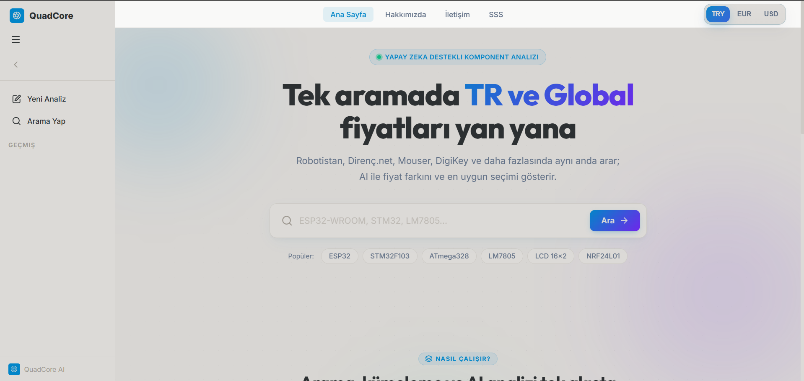
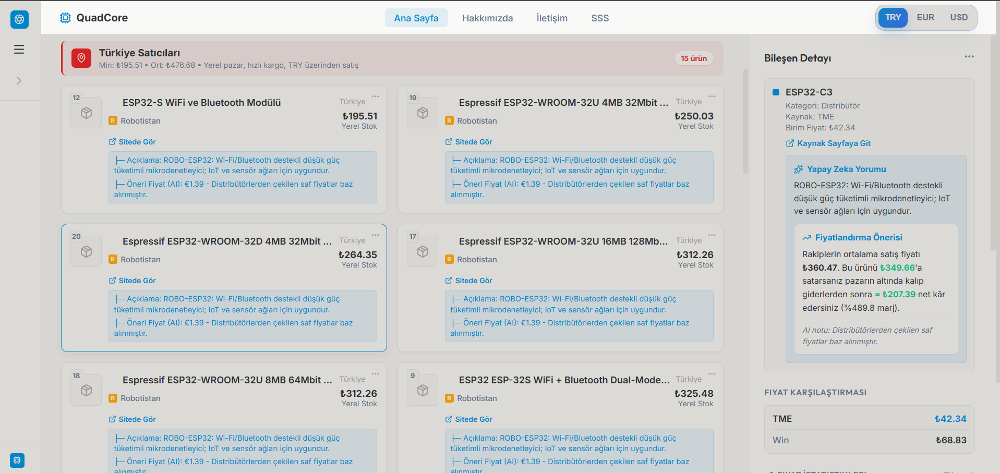
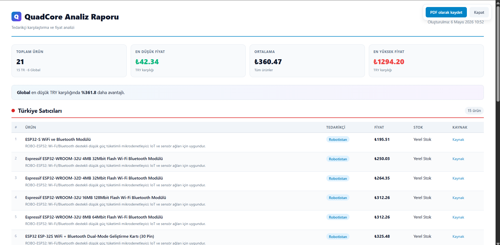
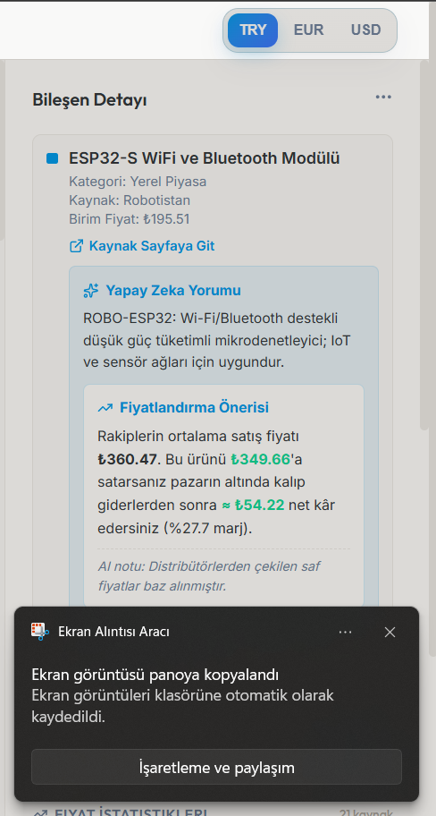
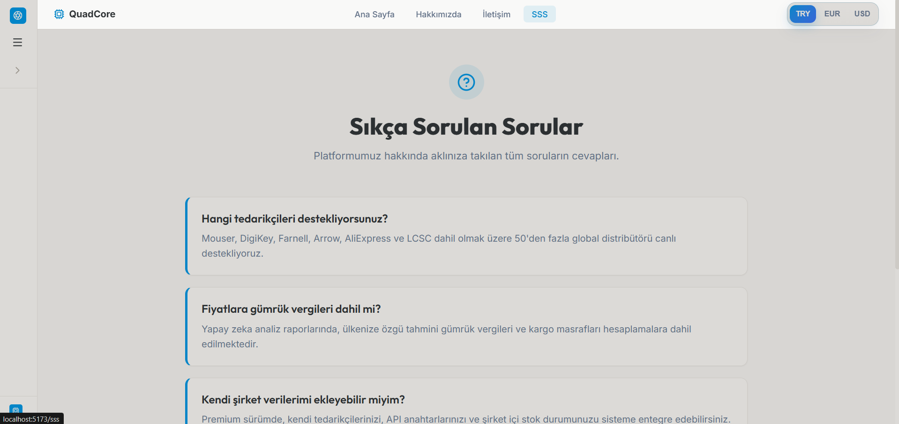
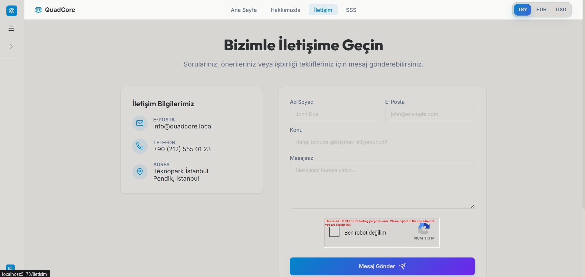

# QuadCore | AI Destekli Ticaret Asistanı

QuadCore, modern satıcılar için geliştirilmiş, yapay zeka destekli bir piyasa analiz ve karar destek sistemidir. Karmaşık pazar verilerini analiz ederek kullanıcıya en uygun alım ve satım stratejilerini sunar.

## Öne Çıkan Özellikler

* **Alırken Kazan (Tedarik Analizi):** Farklı toptancıların fiyat verilerini anlık olarak karşılaştırır ve en maliyet-etkin tedarikçiyi belirlemenizi sağlar.
* **Satırken Kazan (Rekabet Analizi):** Perakende pazarındaki rakiplerin fiyat politikalarını ve stok durumlarını analiz ederek, kâr marjınızı maksimize edecek satış fiyatını önerir.
* **AI Pazar Taraması:** Ürün fotoğrafları veya isimleri üzerinden derin öğrenme algoritmaları kullanarak pazar araştırması yapar.

## Ekran Görüntüleri

Projenin arayüzüne dair görselleri aşağıda inceleyebilirsiniz:

| Ana Sayfa | Ürün Arama | Analiz Raporu |
| :---: | :---: | :---: |
|  |  |  |

| Yapay Zeka Önerisi | SSS | İletişim |
| :---: | :---: | :---: |
|  |  |  |

## Teknoloji Yığını

QuadCore, performans ve ölçeklenebilirlik odaklı modern teknolojilerle geliştirilmiştir:

* **Backend:** Python 3.10+, [FastAPI](https://fastapi.tiangolo.com/) (Yüksek performanslı API yapısı)
* **Frontend:** [React](https://reactjs.org/), [Tailwind CSS](https://tailwindcss.com/) (Responsive ve modern arayüz)
* **Veri Madenciliği:** BeautifulSoup4, Pandas (Pazar verilerinin kazınması ve analizi)
* **Veritabanı:** SQLite (Hızlı ve hafif veri yönetimi)

## Kurulum ve Çalıştırma

Projeyi yerel makinenizde çalıştırmak için aşağıdaki adımları izleyin:

### 1. Depoyu Klonlayın
```bash
git clone [https://github.com/RedLighterr/QuadCoreWebApp.git](https://github.com/RedLighterr/QuadCoreWebApp.git)
cd QuadCoreWebApp
